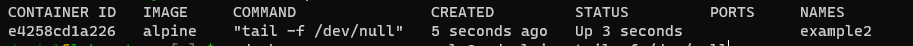

# Aprendiendo Docker

## Primeros Pasos
### Que es?
Docker es un solucion tecnologica para aplicar una filosofia de contenedores; su objetivo principal es apoyar a nuestros equipos de trabajo en la **construccion, distrbucion y ejecucion de codigo o aplicaciones** de forma adecuada y asi no percibir errores en el proceso.

### Es una maquina Virtual?
Docker podria llegar a confundirse con una **maquina virtual** pero la realidad es que poseen **diferencias**. 
Una maquina virtual proporciona una **replica exacta de un ordenador**, Replica: hardware, software y dependencias llegando a un punto en el cual llega a ser muy pesado.
En cambio un sistema de **contenedores** reutiliza secciones del sistema para unicamente **virtualizar procesos**, de tal manera que la reduccion de espacio y consumo es alto.


### Arquitectura de Docker
Entre las principales cosas que debemos conocer de docker estan:

1. (Server) Docker daemon
2. REST API
3. docker cli
    - Container
    - Network
    - Image
    - Data Volume

### Comandos Basicos
Ejemplo: docker [OPTIONS] COMMAND

|commands|descriptions|
|--------|------------|
|ps      | Proporciona informacion de los contenedores en ejecucion|
|inspect | Proporciona informacion mas detallada del contenedor.
|run| Ejecuta un comando en un nuevo contenedor
|rm| Elimina un contenedor
|docker container prune | Borrar todos los containers apagados.|
|exec| Ejecutar un comando en un contenedor en ejecucion.|
|logs| Ver los outputs de ejecucion del contenedor |


### Modo Interactivo
En este ejemplo se intento ejecutar ``docker run alpine `` pero no tuvo exito en su ejecucion ya que su status es ``exited (0)``, es decir, culmino.
**Nota:** Cualquier codigo diferente de cero significa que hubo un error.

**Porque ocurrio?** Esto ocurre, debido a que el comando por defecto que se utilizo fue el shell. Por lo que ejecuto y cerro todo.
Probemos usando ``it``, ``docker run -it alpine``


Como puedes observar se libera el comand prompt del contendor, pero al salir nuevamente este proceso culmina.

#### Ciclo de Vida de un Contenedor
La explicacion por la cual un contenedor se detiene luego de acceder usando un interprete es porque su main process ```/bin/bash``` ya se ejecuto pero sin ninguna otra entrada por lo que inicio y termino.
Para evitar esto debemos proporcionar un comando diferente para que se mantenga en ejecucion.
Ejemplo:
``docker run --name example2 -d alpine tail -f /dev/null``




Para inspeccionar que proceso especifico esta ejecutando este contenedor se puede usar lo siguiente:
``docker inspect --format '{{.State.Pid}}' example2``
Para Eliminarlo
``kill -9 (PID obtenido)``
### Exponiendo Contenedores
Los contenedores de Docker, no poseen la posibilidad de hacer cosas por ellos mismos. Si deseas utilizarlo como usuario debes indicarle a que porciones del equipo anfitrion tienen acceso ya sean carpetas o sean puertos.
**Ejemplos:**
``docker run --name example_web -p 8080:80 -d nginx:alpine``
Exponemos el puerto 8080 de nuestra maquina


``docker ps``


``docker logs example_web``
Para hacer debbugs o test de las peticiones de nginx


**Resultados**


### Compartiendo archivos 
Para compartir archivos con los contenedores en la actualidad en docker se emplean volumenes. Los volumenes son unidades logicas creadas y administradas por docker, y ellas se utilizan para montar dentro del sistema de archivos del contenedor las rutas del equipo anfitrion que se deseen compartir.